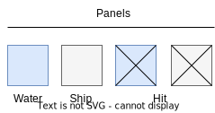

## Battleship - Domain

### Player

There are two `Players` for each `Game`, each player has their own `Board`.

### Board

Represents the play area of the battleship game for each player.

Each `Board` is composed of a list of `Panels`.

                

In the image above, `Coordinate` - A2 represents the location of the `Panel` in the `Board`

A `Board` can be `confirmed`, whether all Ships are place and the board's Player is now `Waiting` for the other player.

### Panel

A `Panel` represents a square in the `Board`, whereas  a `Coordinate` only represents the relative location in the board, a Panel has all of that location's attributes:

                        

each `Ship` panel represents part of a ship and has a type (`ShipType`) for each diferent ship.

When a Panel is hit, changes its state to isHit = true

### Ship

Class that represents a ship in the board, that is, all of that ship's `Coordinates` relative to the `Board` , the type of the Ship (`ShipType`), and if all Panels are Sunk

```Kotlin
data class Ship(val coordinates : Set<Coordinate>, val type : ShipType, val isSunk : Boolean)
```

### ShipType

Enum that represents a Type of ship, which can be:

* Carrier

* Battleship

* Kruiser

* Submarine

* Destroyer

### Game

The main class for the Battleship game, it contains every needed attribute to initialize a game:

```kotlin
val gameId: Int,
val configuration: Configuration,
val player1: Int,
val player2: Int,
val board1: Board,
val board2: Board,
val state: GameState,
val playerTurn: Int,
val winner: Int
```

Every `Game` has its state, for each phase of the game, witch limits operations made to the game.

### GameState

Enum that represents the state of a game:

* NOT_STARTED

* FLEET_SETUP -> Setting up `Ships` location until confirmed

* WAITING

* BATTLE -> Both `Boards` are confirmed and now they can place shots

* FINISHED -> A player has sunk all of other player's ship and is declared winner 

### GameLogic

All the operations that can be done by a `Player` in a `Game`

There are 5 operations that can be done when in a game:

* PlaceShip -> Place a ship in a board

* MoveSip -> Move a ship inside a board

* RotateShip -> Rotate a ship inside a board

* PlaceShot -> Shoot opponent's board

* ConfirmFleet -> Confirm all of ship's location inside a board and advance to Battle

### Configuration

Set of `rules` determined by a `Player` for each `Game`

```kotlin
val boardSize: Int,
val fleet: Set<Pair<ShipType, Int>>,
val nShotsPerRound: Int,
val roundTimeout: Int
```

boardSize -> The size of each player's `Board`

fleet -> The configuration of each ship, that is, its type and its size

nShotsPerRound -> The amount of shots that can be done by each `Player`  

roundTimeout -> Time limit for each Player until they have played.
