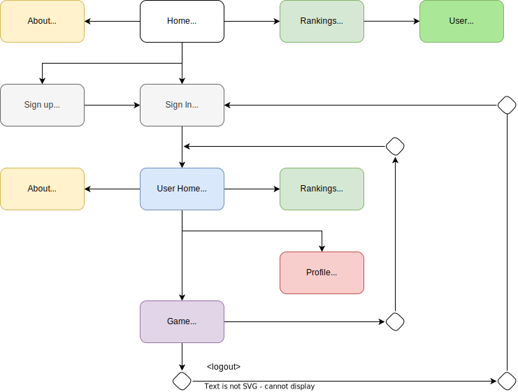

# Frontend

The frontend is all written in `typescript` using [React](https://reactjs.org) framework and `webpack` library to bundle everything together.

## Single Page Application diagram

The diagram bellow shows a possible and common way to navigate the Battleships App. Note that it is possible to access all component from a particular one, either by inserting the URL in the browser or by clicking on the corresponding link, in the App Bar, if available. Not all components will be available if the user is not logged in.

 

## Organization

The frontend is organized in the following way:

- `src/` - All the source code
- `static-files/` - All the static files
- `public/` - The public folder that will be served by the server

Inside `src/` we have the following folders:

- `screens/` - All main React components
- `server_info/` - All the information received from the server (eg: navigation links)
- `utils/` - All the utility functions (eg: `fetch` functions)

Other files like the main App entry point (`index.tsx`) and the app router (`App.tsx`) are also in the `src/` folder.

## App behavior

The server starts by providing the user with the `index.html` file. This file contains the `div` with the id `the-div` that will be used by React to render the app. The `index.html` file also contains the `script` tag that will load the `bundle.js` file that contains all the React code.

The `bundle.js` file is generated by `webpack` and contains all the React code. This file is generated by running `npm run build` in the `frontend/` folder. This command will generate the `bundle.js` file in the `public/` folder.

The first component to be rendered is the `App` component. This component is responsible for rendering the main app layout (like the App top bar) and the router. The router is responsible for rendering the correct component based on the current URL.

As said above, the React Router will be used to choose the appropriate component to render. The router will be configured to render the `Home` component when the user is in the `/` route. The `Home` component will be responsible for rendering the home page.

There are also a number of components that will be only properly rendered when the user is logged in.

## Components

Each component matches a screen and a particular route. These include:

- `Home` - The home page
- `Info` - The info page
- `Leaderboard` - The leaderboard page
- `User` - The user page
- `Authentication` - The register or login page
- `Me` - The game page
- `Game` - The game page

Since the React router is being used, each time the user changes the route, the component that is being rendered will change, and the browser won't reload the page. This is essential for the app to behave like a single page application.

All components use JSX to render the HTML. They, also, support canceling the rendering if the component is unmounted. This is done by using the `useEffect` hook.

If the user tries to access a protected route, and is not logged in, the user will be redirected to the login page.

### Leaderboard component

This component is responsible for rendering the leaderboard page. It will make an API call to get the leaderboard information, and then, it will render the information.
Here, the stats/ranking are displayed in pages, where is possible to go to the next page or the previous page. This takes advantage of the API pagination support.

### Me component

This component is responsible for rendering the user home page. After being rendered, it makes three parallel API calls:

- `Services.fetchUserHome()` - This will return the user home information
- `Services.getCurrentGameId()` - This will return the current game id, if the user is in a game
- `Services.isInGameQueue()` - This will return true if the user is in a game queue

The last two calls are used to decide if to display the `Resume Game` button and the `Abandom Game Queue` button.

### Game component

The game component is the most complex one. It is responsible for rendering the game menu, board, and the game controls.

This one uses a React Reducer to manage the state of the component.

Starts by checking if the user is in a game queue. If so, it will render the internal `Loading` component, until the game does not start. If not, it will check if the user is in a game. If so, it will render the internal `GameBoard` component. If not, it will render the internal `GameMenu` component.

In the menu component, the user can choose the pretended Game configuration, and start a game. This will make an API call to create a game, and then, it will wait until the game starts. When the game starts, it will render the `Playing` component.

In the `Playing` component, the user can place the ships, confirm the fleet, and attack. This component will also render the game controls. It is possible to quit the game at any time.

When the game is finished, the winner will be displayed.

## State management

All API navigation links and actions are stored in the `links` file.
The information that the user is logged in, is stored in the AuthnContainer component. This one, will decide if certain protected routes should be rendered or not. Also, since the API uses cookies for authentication, the AuthnContainer will start by examining the cookies and setting the user as logged in if the cookies are valid.

## Services

The services are responsible for making the API calls. They include the following functions:

- useFetchHome,
- fetchHome,
- useFetchServerInfo,
- useFetchBattleshipRanks,
- useGetUser,
- doLogin,
- createUser,
- createGame,
- getCurrentGameId,
- getGame,
- fetchUserHome,
- placeShips,
- confirmFleet,
- attack,
- quitGame,
- isInGameQueue,
- quitGameQueue,

Each time, a call is made, the function will try to extract all links and actions from the response, if successful. This will allow to call other functions that need this information.

Depending on the function called, they could be using hooks or not. 

The functions that don't use hooks generally return a promise that will be resolved when the API call is finished. These use a normal `fetch` call.
The value returned is usually the pretended expected value, or an error.

The ones that use hooks, will return the current state of the call. The state can be:

- `any` - The value returned by the API call
- `Fetching` - An object that indicates that the API call is still in progress
- `Error` - An object that indicates that the API call failed

In any case, the Error returned is can be one of the following:

- `NetworkError` - Indicates a network error
- `ResolutionLinkError` - Indicates that the API call cannot be done duo to a missing link/action
- `ServerError` - Indicates that the API call returned a Problem+JSON response
- `InvalidArgumentError` - Indicates that the API call cannot be made duo to a missing/invalid argument

## Deep linking

The app supports deep linking. This means that, when the user refreshes the screen, or when the user opens the app in a new tab, the app will render the correct component based on the current URL.

This is done as a combination of mechanisms, that makes this possible. 

The server will always serve the `index.html` file, in case of a 404 error. This file contains the `div` with the id `the-div` that will be used by React to render the app. The `index.html` file also contains the `script` tag that will load the `bundle.js` file that contains all the React code.
Then, the React Router will be used to choose the appropriate component, as said multiple times above.

Also, this wouldn't work alone. When the script is first loaded, the services are called to make an API call. This API call will return the navigation links, and actions, that are relevant.

## Authentication

The authentication is done using cookies. The server will set the cookies when the user logs in. The login action is available as `Services.doLogin()` function.
 The cookies will be used for authentication in all subsequent requests. If not present, the Services functions call will probably fail, and return a Server Error, due to the `fetch` call failing with an exception.